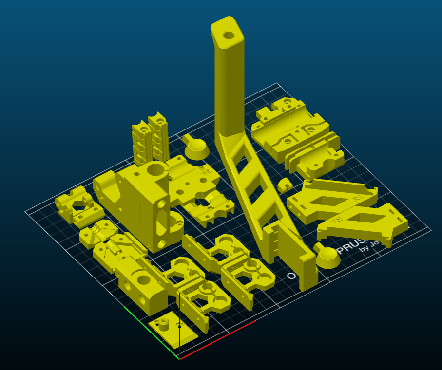

# Introduction

Libnest2D is a library and framework for the 2D bin packaging problem. 
Inspired from the [SVGNest](svgnest.com) Javascript library the project is built from scratch in C++11. The library is written with a policy that it should
be usable out of the box with a very simple interface but has to be customizable
to the very core as well. The algorithms are defined in a header only fashion 
with templated geometry types. These geometries can have custom or already 
existing implementation to avoid copying or having unnecessary dependencies.

A default backend is provided if the user of the library just wants to use it 
out of the box without additional integration. This backend is reasonably 
fast and robust, being built on top of boost geometry and the 
[polyclipping](http://www.angusj.com/delphi/clipper.php) library. Usage of 
this default backend implies the dependency on these packages but its header 
only as well.

This software is currently under construction and lacks a throughout 
documentation and some essential algorithms as well. At this stage it works well
for rectangles and convex closed polygons without considering holes and 
concavities.

Holes and non-convex polygons will be usable in the near future as well. The 
no fit polygon based placer module combined with the first fit selection 
strategy is now used in the [PrusaSlicer](https://github.com/prusa3d/PrusaSlicer) 
application's arrangement feature. It uses local optimization techniques to find
the best placement of each new item based on some features of the arrangement.

In the near future I would like to use machine learning to evaluate the 
placements and (or) the order if items in which they are placed and see what 
results can be obtained. This is a different approach than that of SVGnest which 
uses genetic algorithms to find better and better selection orders. Maybe the 
two approaches can be combined as well.

# Integration 

Using libnest2d in its current state implies the following dependencies:
* [Clipper](http://www.angusj.com/delphi/clipper.php)
* [NLopt](https://nlopt.readthedocs.io/en/latest/)
* [Boost Geometry](https://www.boost.org/doc/libs/1_65_1/libs/geometry/doc/html/index.html)

Integrating the library can be done in at least two ways. Use whichever suits your project the most.

1. The project source tree can be used as a subdirectory (or git submodule) in any other CMake based C++ project by using ```add_subdirectory()``` command in the parent level ```CMakeLists.txt``` file. This method ensures that the appropriate dependencies are detected or downloaded and built automatically if not found. This means that by default, if Clipper and NLopt are not installed, they will be downloaded into the CMake binary directory, built there and linked statically with your project (except for boost geometry). Just add the ```target_link_library(<your_target> libnest2d)``` line to your CMake build script. You can also compile the library with the selected dependencies into a static or shared library. To do this just disable the ```LIBNEST2D_HEADER_ONLY``` option in the CMake config. 

2. Copying source files directly into a target project: The library is header 
only and it is enough to just copy the content of the ```include``` directory or  specify the location of these headers to the compiler. Be aware that in this case you are on your own regarding the geometry backend and optimizer selection. To keep things simple just define ```LIBNEST2D_BACKEND_CLIPPER``` and ```LIBNEST2D_OPTIMIZER_NLOPT``` before including ```libnest2d.h```. You will also need to link to these libraries manually. 

Please note that the clipper backend still uses some algorithms from ```boost::geometry``` (header only). The boost headers are not downloaded by the build script and later releases will probably get rid of the direct dependency. 

The goal is to provide more geometry backends (e.g. boost only) and optimizer engines (e.g. optimlib) in the future. This would make it possible to use the already available dependencies in your project tree without including new ones.

# Example

A simple example may be the best way to demonstrate the usage of the library.

``` c++
#include <iostream>
#include <string>

// Here we include the libnest2d library
#include <libnest2d.h>

int main(int argc, const char* argv[]) {
    using namespace libnest2d;

    // Example polygons 
    std::vector<Item> input1(23,
    {
        {-5000000, 8954050},
        {5000000, 8954050},
        {5000000, -45949},
        {4972609, -568550},
        {3500000, -8954050},
        {-3500000, -8954050},
        {-4972609, -568550},
        {-5000000, -45949},
        {-5000000, 8954050},
    });
    std::vector<Item> input2(15,
    {
       {-11750000, 13057900},
       {-9807860, 15000000},
       {4392139, 24000000},
       {11750000, 24000000},
       {11750000, -24000000},
       {4392139, -24000000},
       {-9807860, -15000000},
       {-11750000, -13057900},
       {-11750000, 13057900},
    });

    std::vector<Item> input;
    input.insert(input.end(), input1.begin(), input1.end());
    input.insert(input.end(), input2.begin(), input2.end());

    // Perform the nesting with a box shaped bin
    size_t bins = nest(input, Box(150000000, 150000000));

    // Retrieve resulting geometries
    for(Item& r : input) {
        auto polygon = item.transformedShape();
        // render polygon...
    }

    return EXIT_SUCCESS;
}
```

It is worth to note that the type of the polygon carried by the Item objects is
the type defined as a polygon by the geometry backend. In the example we use the
clipper backend and clipper works with integer coordinates.

Of course it is possible to configure the nesting in every possible way. The
```nest``` function can take placer and selection algorithms as template arguments and their configuration as runtime arguments. It is also possible to pass a progress indication functor and a stop condition predicate to control the nesting process. For more details see the ```libnest2d.h``` header file.

## Example output


## Screenshot from Slic3r PE 

For the record, **Slic3r PE** version 2.0 is now known as **PrusaSlicer 2.0**.



# References
- [SVGNest](https://github.com/Jack000/SVGnest)
- [An effective heuristic for the two-dimensional irregular
bin packing problem](http://www.cs.stir.ac.uk/~goc/papers/EffectiveHueristic2DAOR2013.pdf)
- [Complete and robust no-fit polygon generation for the irregular stock cutting problem](https://www.sciencedirect.com/science/article/abs/pii/S0377221706001639)
- [Applying Meta-Heuristic Algorithms to the Nesting
Problem Utilising the No Fit Polygon](http://www.graham-kendall.com/papers/k2001.pdf)
- [A comprehensive and robust procedure for obtaining the nofit polygon
using Minkowski sums](https://www.sciencedirect.com/science/article/pii/S0305054806000669)
